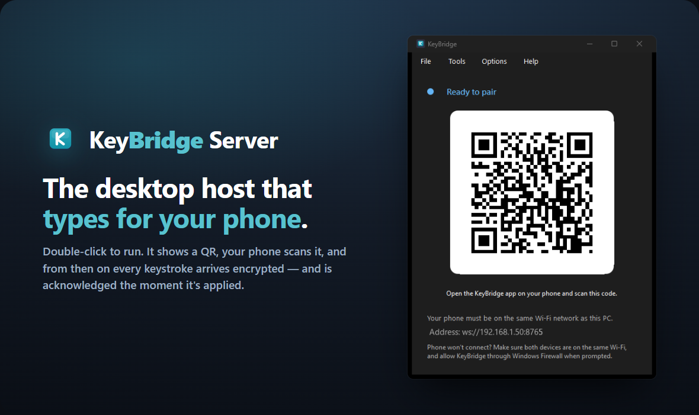
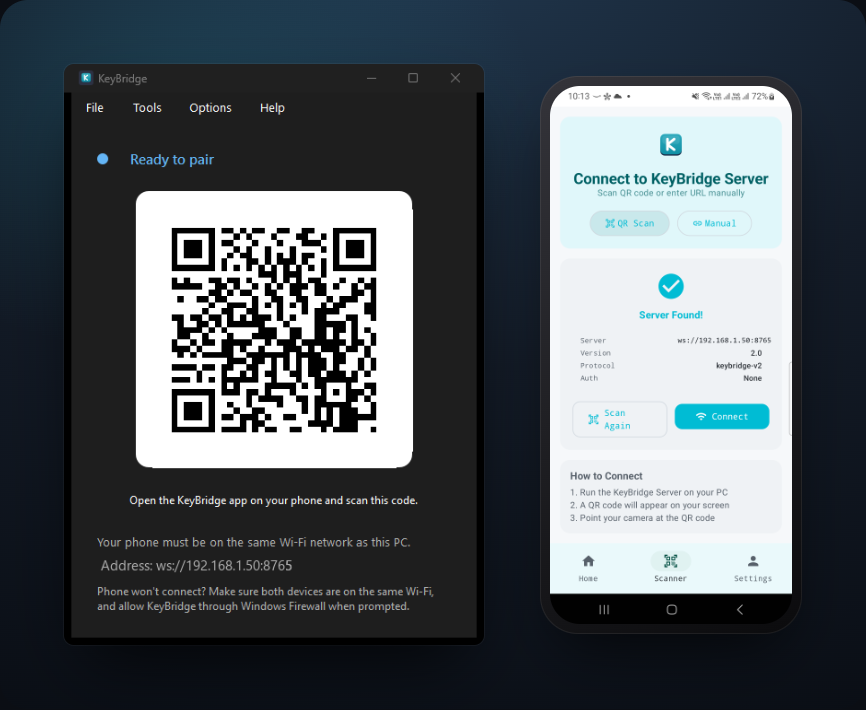

<p align="center">
  
</p>

<p align="center">
  Receives keystrokes from the KeyBridge phone app over your local network and types them
  <br>on this computer — encrypted, authenticated, and acknowledged on arrival.
</p>

<p align="center">
  <b>Desktop host.</b> Pairs with the Android client →
  <a href="https://github.com/dog-broad/KeyBridge">KeyBridge</a>
</p>

---

KeyBridge Server is the other half of KeyBridge: it runs on the machine you want to control,
shows a QR code to pair, and applies the text, hotkeys, and media keys your phone sends as
real input. It runs as a small windowed app that recedes to the system tray once a device is
connected, so you can always tell at a glance whether something can type on this PC.

## Run it

**From source**

```bash
python -m venv venv
venv\Scripts\activate          # Windows  (use: source venv/bin/activate on Linux/macOS)
pip install -r requirements.txt
python src/launcher.py
```

A window opens with a QR code. Scan it from the
**[KeyBridge app](https://github.com/dog-broad/KeyBridge)** on a phone that's on the same
Wi-Fi, and you're paired.

> Prefer a terminal-only host with no window? `python src/main.py` runs the bridge and
> prints the QR to the console.

**As a double-click app (Windows)**

The host packages into a self-contained Windows app — no Python required to run it:

```bash
pyinstaller packaging/keybridge.spec        # -> dist/KeyBridge/KeyBridge.exe
iscc packaging/keybridge.iss                # optional: -> an installer
```

## Pairing

<p align="center">
  
</p>

The host generates a **fresh pairing secret every run** and shows it only inside the QR. The
phone reads the address and the secret from the code — nothing secret is ever sent over the
network, and there is no key stored in the source.

## Security model

- **Per-session key.** Each connection derives its own key, `HMAC-SHA256(pairing_secret, salt)`,
  from a per-connection salt exchanged in the handshake. Different session, different key.
- **AES-256-GCM** on every message after the handshake, with a unique nonce per message.
- **Implicit authentication, no downgrade.** A message that doesn't authenticate under the
  session key is rejected and the connection is closed. There is no plaintext fallback.
- **Bounded per-client state.** Rate-limit and session tables evict idle clients, so a
  high-churn or hostile peer can't grow memory without limit.

See **[PROTOCOL.md](PROTOCOL.md)** for the exact scheme.

## Protocol

Input arrives in a small versioned envelope; the server acknowledges every chunk it applies,
so the client knows exactly what landed. Long text is split into ordered chunks the client
tracks as progress.

```json
// in
{ "v": 1, "id": "…", "seq": 0, "total": 1, "type": "type", "payload": { "text": "Hello, world" } }
// out
{ "v": 1, "type": "ack", "id": "…", "seq": 0, "status": "ok" }
```

The full contract — envelope fields, input types, acknowledgement shape, chunking, and
idempotent retry — is in **[PROTOCOL.md](PROTOCOL.md)**.

## Configuration

Optional, via environment variables (e.g. a `src/.env` file):

```bash
RATE_LIMIT=300            # messages per minute per connection
ENABLE_ENCRYPTION=true    # set false only for local plaintext testing
```

There is no secret to configure — it's generated each run and delivered through the QR.
Logs and the generated QR are written under `%LOCALAPPDATA%\KeyBridge` when installed, or the
working directory when run from source.

## Built with

Python · `asyncio` + `websockets` · `pynput` for input · PySide6 for the window and tray ·
PyInstaller + Inno Setup for the Windows build. Python 3.8+ (Windows; Linux/macOS where
`pynput` is supported).

<details>
<summary><b>Supported keys</b></summary>

`backspace` `tab` `enter` `space` `esc` · `shift` `ctrl` `alt` `cmd`/`win` ·
`up` `down` `left` `right` · `home` `end` `page_up` `page_down` `insert` `delete` ·
`f1`–`f12` · `caps_lock` `num_lock` `scroll_lock` `print_screen` `pause` `menu` ·
`media_play_pause` `media_next` `media_previous` `media_volume_up` `media_volume_down` `media_volume_mute`

</details>

## License

[Apache License 2.0](LICENSE).
